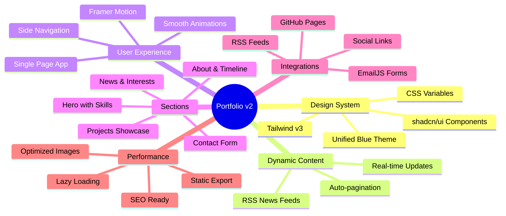
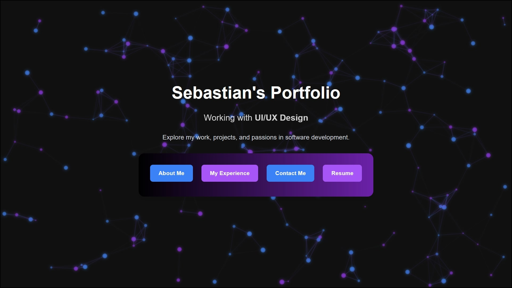

<div align="center">


<p align="center">
  <a href="#features">Features</a> •
  <a href="#demo">Demo</a> •
  <a href="#tech-stack">Tech Stack</a> •
  <a href="#installation">Installation</a> •
  <a href="#development">Development</a>
</p>

[](LICENSE)
[](https://sebas-d-dev.github.io/portfolio-v2)
[](https://nextjs.org)
[](https://www.typescriptlang.org)
[](https://tailwindcss.com)

<p align="center">A modern, professional single-page portfolio showcasing projects, experience, and tech interests with dynamic RSS news integration, smooth animations, and a unified blue design system. ✨</p>

</div>

---

## ✨ Features
<a id="features"></a>

<div align="center">



</div>

## 🚀 Demo
<a id="demo"></a>

Experience the live portfolio at **[https://sebas-d-dev.github.io/portfolio-v2](https://sebas-d-dev.github.io/portfolio-v2)**



## 🎨 Design System

### Blue Theme Color Palette
- **Primary Blue**: `#2563eb` - Main interactive elements
- **Secondary Blue**: `#38bdf8` - Accents and highlights  
- **Accent Cyan**: `#22d3ee` - Special highlights
- **Dark Background**: `#020617` - Base background

### Features
- ✅ Unified blue design system (replacing 25+ inconsistent colors)
- ✅ Tailwind CSS v4 with custom configuration
- ✅ CSS variables for consistent spacing, shadows, and transitions
- ✅ Responsive design with mobile-first approach
- ✅ Accessible with WCAG AA color contrast

## 🚀 Architecture

### Single-Page Application
Transformed from 4 separate pages into a seamless single-page experience:

1. **Hero Section** - Animated introduction with rotating skills
2. **About & Experience Section** - Bio, tech stack, and timeline
3. **Projects Section** - Portfolio showcase with GitHub integration
4. **News & Interests Section** - Dynamic RSS feeds from tech sources
5. **Contact Section** - Form with EmailJS integration

### Tech Stack
<a id="tech-stack"></a>

<div align="center">

<table>
<tr>
<td align="center" width="96">

<br>Next.js 15.5
</td>
<td align="center" width="96">

<br>React 19
</td>
<td align="center" width="96">

<br>TypeScript 5
</td>
<td align="center" width="96">

<br>Tailwind v3
</td>
</tr>
<tr>
<td align="center" width="96">

<br>Framer Motion
</td>
<td align="center" width="96">

<br>GitHub Pages
</td>
<td align="center" width="96">

<br>Vercel
</td>
<td align="center" width="96">

<br>VS Code
</td>
</tr>
</table>

</div>

## 📰 News Integration

RSS feeds from multiple sources:
- **Tech Giants**: FAANG companies (Google, Apple, Meta, Amazon, Microsoft)
- **AI Companies**: NVIDIA, AMD, OpenAI
- **VR/AR**: Virtual Reality and Augmented Reality news
- **Automation**: n8n, workflow automation tools
- **Software Engineering**: Backend, frontend, DevOps topics
- **FAU**: Florida Atlantic University news

## 🔧 Setup & Installation
<a id="installation"></a>

### Prerequisites
- Node.js 20+ 
- npm or yarn

### Installation

1. **Clone the repository**
   ```bash
   git clone https://github.com/Sebas-D-Dev/portfolio-v2.git
   cd portfolio-v2
   ```

2. **Install dependencies**
   ```bash
   npm install
   ```

3. **Environment Variables**
   
   Create a `.env.local` file based on `.env.local.example`:
   ```env
   # EmailJS Configuration (required for contact form)
   NEXT_PUBLIC_EMAILJS_SERVICE_ID=your_service_id
   NEXT_PUBLIC_EMAILJS_TEMPLATE_ID=your_template_id
   NEXT_PUBLIC_EMAILJS_PUBLIC_KEY=your_public_key
   
   # News API (optional - for RSS news feed)
   # Get free API key at https://newsapi.org
   NEXT_PUBLIC_NEWS_API_KEY=your_news_api_key
   ```

4. **Run development server**
   ```bash
   npm run dev
   ```
   
   Open [http://localhost:3000](http://localhost:3000)

5. **Build for production**
   ```bash
   npm run build
   ```

## 📁 Project Structure

```
portfolio-v2/
├── app/
│   ├── data/
│   │   ├── content.ts          # Centralized content management
│   │   └── news.ts             # News categories configuration
│   ├── layouts/
│   │   ├── navigation.tsx      # Fixed navigation with smooth scroll
│   │   └── footer.tsx          # Footer with social links
│   ├── pages/                  # Redirect pages for old routes
│   ├── styles/                 # CSS modules and global styles
│   ├── globals.css             # Design system variables
│   ├── layout.tsx              # Root layout with metadata
│   └── page.tsx                # Main single-page app
├── components/
│   ├── sections/               # Section components
│   │   ├── HeroSection.tsx
│   │   ├── AboutExperienceSection.tsx
│   │   ├── ProjectsSection.tsx
│   │   ├── NewsInterestsSection.tsx
│   │   └── ContactSection.tsx
│   ├── ParticlesBackground.tsx # Canvas particle animation
│   ├── ScrollButton.tsx        # Animated scroll-to-top button
│   └── DropdownMenu.tsx        # Mobile navigation menu
├── public/assets/              # Static assets (images, icons, resume)
├── tailwind.config.ts          # Tailwind configuration
├── next.config.ts              # Next.js configuration
└── package.json                # Dependencies
```

## 🎯 Key Features

### 1. Design System
- Unified blue color palette across entire site
- CSS variables for consistent spacing and effects
- Tailwind-first approach with custom utilities
- Accessible focus states and ARIA landmarks

### 2. Smooth Animations
- Framer Motion for page sections and transitions
- Viewport-triggered animations
- Staggered children animations
- Interactive hover effects
- Particle background with Canvas API

### 3. Responsive Design
- Mobile-first approach
- Breakpoints: 360px, 640px, 768px, 1024px, 1200px
- Adaptive navigation (hamburger menu on mobile)
- Optimized images with Next.js Image component

### 4. Performance Optimizations
- Static site generation for fast load times
- Optimized particle system (100 particles, down from 200)
- Lazy loading for below-fold content
- Compressed images and assets

### 5. SEO & Accessibility
- Comprehensive meta tags (Open Graph, Twitter Card)
- Semantic HTML structure
- ARIA labels and landmarks
- Keyboard navigation support
- Focus visible indicators
- Alt text for all images

## 🛠️ Development
<a id="development"></a>

### Available Scripts

```bash
npm run dev      # Start development server
npm run build    # Build for production
npm run start    # Start production server
npm run lint     # Run ESLint
```

### Adding Content

Edit `/app/data/content.ts` to update:
- Personal information
- Skills and tech stack
- Projects
- Work experience
- Education

### Customizing Design

Modify `/tailwind.config.ts` to adjust:
- Color palette
- Breakpoints
- Spacing scale
- Typography
- Animations

Edit `/app/globals.css` for:
- CSS variables
- Global styles
- Custom animations

## 📧 EmailJS Setup

1. Create account at [EmailJS](https://www.emailjs.com/)
2. Create an email service
3. Create an email template
4. Add credentials to `.env.local`

Template variables:
- `{{from_name}}` - Sender name
- `{{from_email}}` - Sender email
- `{{message}}` - Message content
- `{{to_email}}` - Recipient email
- `{{time}}` - Timestamp

## 📰 News API Setup

1. Get free API key at [NewsAPI.org](https://newsapi.org/)
2. Add `NEXT_PUBLIC_NEWS_API_KEY` to `.env.local`
3. News section will automatically fetch latest articles

**Note**: Free tier has limitations (100 requests/day). For production, consider upgrading or using alternative news sources.

## 🚀 Deployment

### GitHub Pages

1. Update `next.config.ts` basePath if needed
2. Build the project:
   ```bash
   npm run build
   ```
3. Deploy the `out/` directory to GitHub Pages

### Vercel (Recommended)

[](https://vercel.com/new/clone?repository-url=https://github.com/Sebas-D-Dev/portfolio-v2)

1. Import repository to Vercel
2. Add environment variables
3. Deploy automatically

## 🐛 Troubleshooting

### Build Errors

**Issue**: Module not found errors
```bash
npm install           # Reinstall dependencies
rm -rf .next          # Clear Next.js cache
npm run build         # Rebuild
```

**Issue**: TypeScript errors
```bash
npm run lint          # Check for lint errors
```

### Development Issues

**Issue**: Port 3000 already in use
- Dev server will automatically use port 3001
- Or manually specify: `npm run dev -- -p 3002`

**Issue**: Environment variables not working
- Ensure `.env.local` exists
- Restart dev server after adding variables
- Use `NEXT_PUBLIC_` prefix for client-side variables

## 📝 License

MIT License - See [LICENSE](LICENSE) file

## 👤 Author

**Sebastian Torres**
- GitHub: [@Sebas-D-Dev](https://github.com/Sebas-D-Dev)
- LinkedIn: [Sebastian Torres](https://www.linkedin.com/in/sebastian-torres-dev/)
- Email: sebas.t.nait@gmail.com

## 🙏 Acknowledgments

- Design inspiration from modern portfolio sites
- Particle animation technique from Canvas API tutorials
- RSS feeds powered by [AllOrigins CORS Proxy](https://allorigins.win/)
- Icons from [Heroicons](https://heroicons.com/)
- Email service by [EmailJS](https://www.emailjs.com/)
- UI components from [shadcn/ui](https://ui.shadcn.com/)

---

<div align="center">

**Last Updated**: February 2025

Built with ❤️ using Next.js, TypeScript, and Tailwind CSS


</div>
